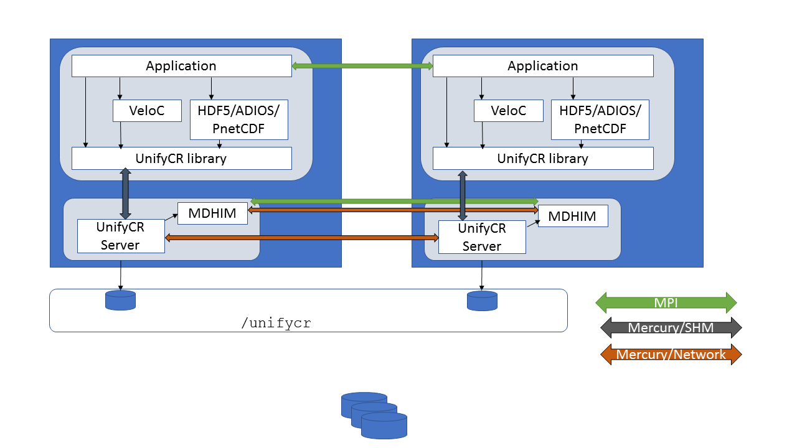

================
Overview
================

UnifyCR is a user level file system currently under active development. An 
application can use node-local storage as burst buffers for shared files. 
UnifyCR is designed to support both checkpoint/restart which is the most 
important I/O workload for HPC and other common I/O workloads as well. With 
UnifyCR, applications can write to fast, scalable, node-local burst buffers as 
easily as they do the parallel file system. This section will provide a high 
level design of UnifyCR. It will describe the UnifyCR library and the UnifyCR 
daemon.

---------------------------
High Level Design
---------------------------

UnifyCR will present a shared namespace (e.g., /unifycr as a mount point) to 
all compute nodes in a users job allocation. There are two main components of 
UnifyCR: the UnifyCR library and the UnifyCR daemon. The UnifyCR library (also 
referred to as the UnifyCR client library) is linked into the user application 
and is responsible for intercepting I/O calls from the user application and 
then sending the I/O requests on to a UnifyCR server to be handled. The UnifyCR 
client library uses the ECP `GOTCHA <https://github.com/LLNL/GOTCHA>`_ software 
as its primary mechanism for intercepting I/O calls. Each UnifyCR daemon (also 
referred to as a UnifyCR server daemon) runs as a daemon on a compute node in 
the users allocation. The UnifyCR server is responsible for handling the I/O 
requests from the UnifyCR library. On each compute node, there will be user 
application processes running as well as tool daemon processes. The user 
application is linked with the UnifyCR client library and a high-level I/O 
library, e.g. HDF5, ADIOS, or PnetCDF. The UnifyCR server daemon also runs on 
the compute node and is linked with the MDHIM library which is used for 
metadata services.
