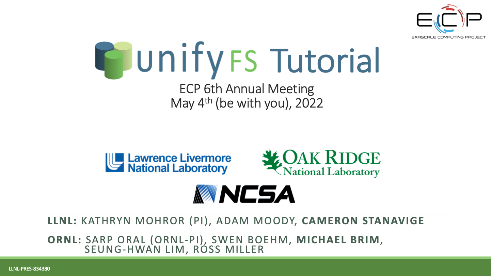

========
Overview
========

UnifyFS is a user-level file system under active development
that supports shared file I/O over distributed storage on HPC systems,
e.g., node-local burst buffers.
With UnifyFS, applications can write to fast, scalable, node-local burst buffers as
easily as they do to the parallel file system.
UnifyFS is designed to support common I/O workloads such as
checkpoint/restart and other bulk-synchronous I/O workloads typically
performed by HPC applications.

Because the UnifyFS file system is implemented at user-level,  the
file system is visible only to applications linked with the UnifyFS client library.
A consequence of this is that
traditional file system tools (ls, cd, etc.) installed by system administrators
cannot act on files in a UnifyFS file system because they are not linked
against the UnifyFS client library.
The lifetime of a UnifyFS file system is the duration of the execution of
the UnifyFS server processes, which is typically for the duration of an
HPC job.
When the servers exit, the UnifyFS file system terminates.
Users must copy files that need to be persisted beyond the lifetime of the
job from UnifyFS to a permanent file system.
UnifyFS provides an API and a utility to perform these copies.

-----

-----------------
High Level Design
-----------------

.. image:: images/design-high-lvl.png

This section provides a high
level design of UnifyFS.
UnifyFS presents a shared namespace (e.g., /unifyfs as a mount point) to
all compute nodes in a job allocation. There are two main components of
UnifyFS: the UnifyFS library and the UnifyFS server.

The UnifyFS library is linked into the user application.
The library intercepts I/O calls from the application and
sends I/O requests for UnifyFS files on to the UnifyFS server.
The library forwards I/O requests for all other files on to the system.
The UnifyFS library uses ECP `GOTCHA <https://github.com/LLNL/GOTCHA>`_
as its primary mechanism to intercept I/O calls.
The user application is linked with the UnifyFS client library
and perhaps a high-level I/O library, like HDF5, ADIOS, or PnetCDF.

A UnifyFS server process runs on each compute node in
the job allocation. The UnifyFS server handles the I/O
requests from the UnifyFS library.
The UnifyFS server uses ECP `Mochi <https://mochi.readthedocs.io/en/latest>`_
to communicate with user application processes and server processes on other nodes.

-----

----------------
UnifyFS Citation
----------------

We recommend that you use this as the primary citation for UnifyFS as well as a
reference for further details on the UnifyFS architecture and semantics:

    Michael Brim, Adam Moody, Seung-Hwan Lim, Ross Miller, Swen Boehm, Cameron Stanavige, Kathryn Mohror, Sarp Oral, “UnifyFS: A User-level Shared File System for Unified Access to Distributed Local Storage,” 37th IEEE International Parallel & Distributed Processing Symposium (IPDPS 2023), St. Petersburg, FL, May 2023.

-----

--------------
UnifyFS Videos
--------------

Quickstart
**********

Quick overview on what UnifyFS is and how to use it.

.. raw:: html

    

        <iframe width="560" height="315" src="https://www.youtube.com/embed/A_6lG_4EE2M?si=GCcwE3M68fsYUmO_" title="YouTube video player" frameborder="0" allow="accelerometer; autoplay; clipboard-write; encrypted-media; gyroscope; picture-in-picture; web-share" allowfullscreen></iframe>
    

-----

ECP Tutorial
************

More in-depth recording of the problems UnifyFS solves and a how-to using a
pre-1.0 beta version.

.. raw:: html

    

        <iframe width="560" height="315" src="https://www.youtube.com/embed/FmQVJplyVdw?si=_V7f-m_5eOLe90eT" title="YouTube video player" frameborder="0" allow="accelerometer; autoplay; clipboard-write; encrypted-media; gyroscope; picture-in-picture; web-share" allowfullscreen></iframe>
    

.. rubric:: UnifyFS Tutorial Slides - ECP 2022

:download:`Download PDF <slides/UnifyFS-tutorial-May2022.pdf>`.

|

.. rubric:: Changes since above ECP 2022 Tutorial:

- Video 30:04 | Slide 19 - Variants ``boostsys`` and ``preload`` have since been
  added.
- Video 31:08 | Slide 22 - OpenSSL is also a dependency that was missed on this slide.
- Video 41:10 | Slide 48 - User Guide url starts with *https*, not *http*.

For full changes since the pre-1.0 beta version of UnifyFS used in the May 2022
tutorial, see the `UnifyFS release notes <https://github.com/LLNL/UnifyFS/releases>`_.
